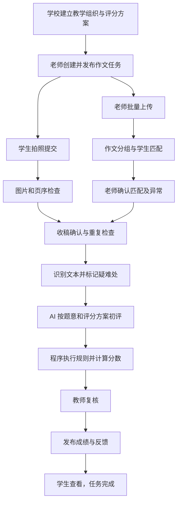
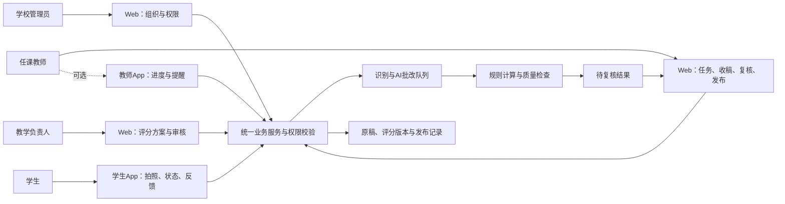
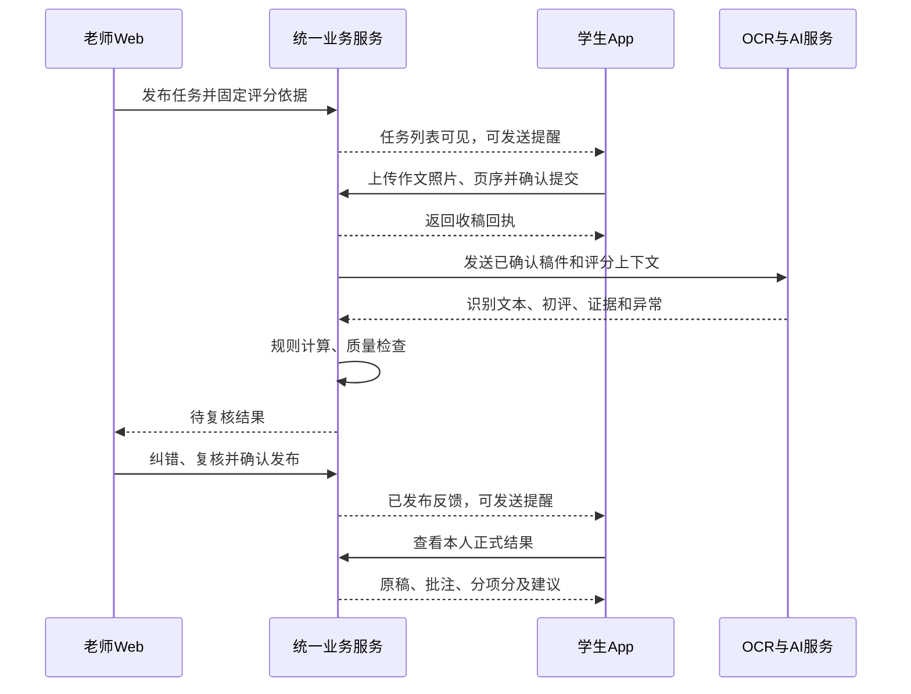
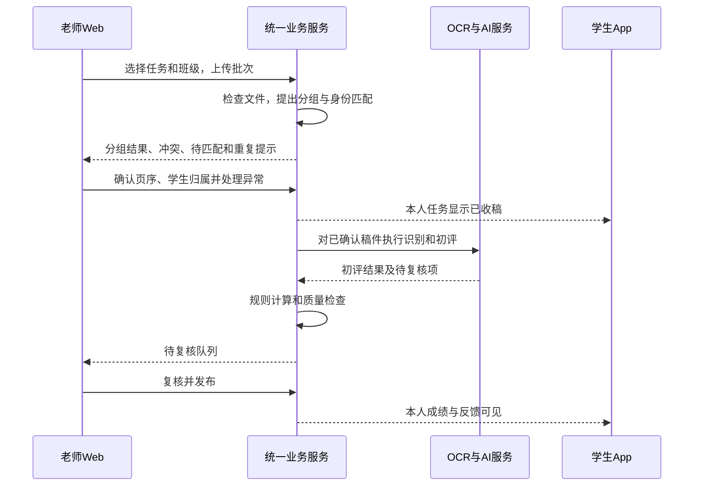
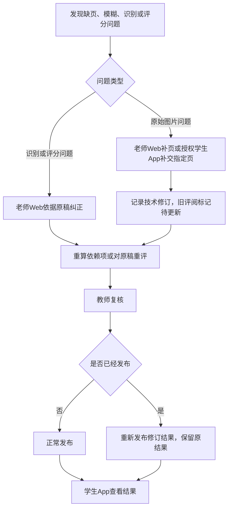

# 作文智能批改系统｜总体需求文档

版本：v1.1
更新日期：2026-09-28
文档状态：需求汇总与设计草稿，可用于产品、教学及研发评审。

> 本文汇总本次沟通中已确认的范围，并补充落地所需的设计建议。标记为“已确认”的范围应作为当前基线；未确认的产品选择和教学口径集中列于文末，不阻碍其他模块设计。具体优先级、交付范围和评分口径由产品负责人及学校教学负责人确认。

## 1. 产品定位与目标

面向学校、教师和学生的作文智能批改系统。学校管理教学组织与评分标准，老师组织作文任务并复核结果，学生提交手写作文并查看反馈，AI 根据确定的标准提供初评与批注。

业务目标：

- 降低教师收稿、识别、初评和整理反馈的重复劳动。
- 支持不同学校、年级、文体与题目的评分要求。
- 将评分依据、规则调整和教师改分过程清晰呈现，便于解释与追溯。
- 确保原稿、学生身份、任务和成绩准确对应。

核心原则：AI 负责理解和评价，程序负责确定性计分，教师负责复核与发布；评分标准独立于模型和提示词管理。

## 2. 当前范围与明确排除项

### 2.1 已确认范围

1. 支持学生拍照提交和老师批量上传两种入口。
2. 两种入口共用同一套收稿、识别、AI 批改、教师复核与发布流程。
3. 支持学校、教师、学生角色，以及适用于不同学校、年级的评分方案。
4. AI 初评后由老师复核并发布，学生查看成绩和批改反馈。
5. 当前版本去掉重写要求，结果发布后本次作文任务完成。
6. 保留提交纠错和对原稿的评分复核，保留必要操作记录。

### 2.2 当前不纳入范围

- 在线键入作文作为独立提交入口。
- 同题重写、学生二次创作提交、稿件进步对比及重写后评分。
- 学生在线订正、订正提交与订正验收工作流；反馈可以包含修改建议，但不要求再次提交。
- 自动推算 DSE 总科等级、跨校分数排名。
- 自动向学生发布未经教师复核的成绩。
- 通用教务管理、家长端和正式申诉工单系统。
- 教师改分直接自动用于模型训练。

### 2.3 提交纠错与评分复核的边界

| 类型 | 允许操作 | 处理原则 |
|---|---|---|
| 提交纠错 | 补齐缺页、替换模糊图片、纠正页序或学生归属 | 还原同一份原作文，不作为重写 |
| 识别纠错 | 教师依据原图修正识别文字 | 保存识别前后差异与操作者 |
| 评分复核 | 修改品第、分数、批注，或对原稿重新批改 | 不修改学生作文内容，保留前后结果 |
| 创作内容修改 | 学生改变立意、选材、句段内容并重交 | 当前不提供该工作流 |

## 3. 角色与权限

角色可以由同一用户兼任，但权限分别配置。账号管理权限不自动包含改分权限。

| 角色 | 主要权限 | 范围限制 |
|---|---|---|
| 学校管理员 | 学校设置、学年班级、师生导入、角色分配 | 本校范围；作文访问需单独授权 |
| 科主任／教学负责人 | 评分方案审核发布、校本规则管理、评分质量分析 | 授权学校或学科范围 |
| 年级负责人 | 年级评分方案、年级任务与分析 | 授权年级范围 |
| 任课教师 | 创建任务、批量上传、收稿确认、批改复核、发布 | 所任教或明确授权的班级与任务 |
| 学生 | 查看任务、拍照提交、查看提交状态和已发布反馈 | 仅本人数据 |

AI 是系统处理能力，不拥有独立发布或越权修改评分方案的权限。

## 4. 学校组织与学生身份

### 4.1 组织结构

学校 → 学年 → 年级 → 班级 → 就读记录；教师通过任课关系关联班级。教学小组为可选组织，不作为评分主流程的必要条件。

### 4.2 学生字段归属

| 字段 | 归属对象 | 说明 |
|---|---|---|
| 学生内部 ID | 学生身份 | 稳定标识，不随升班变化 |
| 登录账号 | 账号 | 与学生身份关联，可按学校规则维护 |
| 姓名 | 学生资料 | 不作为唯一匹配依据 |
| 性别 | 学生资料（可选） | 不参与作文质量评分 |
| 年级、所在班级 | 学年就读记录 | 保存升班前后的历史 |
| 班级学号／班号 | 学年就读记录 | 与全校学生编号分开，同班同学年内校验唯一性 |
| 小组 | 教学或任务分组 | 可随教学安排变化 |

系统不以“姓名”或“班级＋班号”作为永久学生身份。历史作文必须继续关联原学生及当时的教学上下文。

## 5. 系统模块与页面

| 模块 | 主要页面 | 主要能力 |
|---|---|---|
| 学校与教学组织 | 学年班级、师生名单、任课关系、权限设置 | 建立教学对象和访问边界 |
| 评分标准中心 | 模板列表、方案编辑、版本详情、审核发布 | 配置并管理评分依据 |
| 作文任务中心 | 任务列表、创建任务、任务详情 | 确定题目、对象、提交要求与评分方案 |
| 收稿管理 | 学生名单、上传批次、待匹配稿件、异常队列 | 分组、匹配、补页、去重与完整性确认 |
| 批改工作台 | 原稿、识别文本、批注、评分与待复核项 | AI 初评、人工复核和计分解释 |
| 成绩与反馈 | 发布管理、学生结果页、历史改分记录 | 发布成绩与可追溯反馈 |
| 学情与质量 | 班级问题分析、评分偏差与任务运行概览 | 辅助教学和验证评分质量 |

## 6. 总体业务流程



异常可以退回收稿或识别确认环节；不设置“学生重写”分支。

## 7. 评分方案设计

### 7.1 方案层次

官方参考模板 → 校本方案 → 年级／文体方案 → 本次任务评分快照。

- 官方模板标记来源、年份和卷别，保留原版。
- 校本修改形成派生方案，展示相对来源方案的差异。
- 学校修改官方模板后，应标记为“校本方案，参考某版本 DSE”，不冒充官方原版。
- 不同班可使用同一方案，同一班不同任务也可使用不同方案。
- 发布任务时锁定评分快照，后续模板更新不影响历史任务。

### 7.2 方案配置内容

| 配置项 | 内容 |
|---|---|
| 基本信息 | 名称、学校、负责人、来源、年份、版本、生效范围 |
| 适用范围 | 年级、文体、练习／测评等 |
| 维度 | 内容、表达、结构、标点字体等，允许校本配置 |
| 评分尺度 | 品第、直接分数或描述等级；档位顺序、名称、等级值 |
| 档位描述 | 各维度各档的判断要求、示例及边界说明 |
| 计分规则 | 满分、换算、舍入、汇总方式 |
| 限制与调整 | 字数上限约束、离题限制、错字计分及校本调整 |
| 题目要求 | 题意、文体、任务要素、合理诠释范围和入品要求 |
| 评分样例 | 经教师认可的作文、品第、理由和临界样例 |
| 复核策略 | 需要确认的异常、操作权限 |
| 可修改范围 | 老师可调整的字段及必须遵循的学校规则 |

扩展不同年级时应调整档位描述和样例，不能只缩放分值或修改权重。

### 7.3 方案生命周期

草稿 → 待审核 → 已发布 → 已停用。

已发布版本不可原地覆盖；修改生成新版本。停用版本不可用于新任务，但历史记录仍可查看。

## 8. DSE 参考规则与实现要求

### 8.1 已核实依据与适用边界

参考文件：[香港考评局《2025年香港中学文凭考试中国语文科教师会议：试卷二乙部命题写作》](https://www.hkeaa.edu.hk/DocLibrary/HKDSE/Subject_Information/chi_lang/CHI-BS-2025-3.pdf)。通用评分规则见第4—9页，各题另有专属题意和入品说明。

此处仅确认该文件版本，不代表其他年份、卷别或小学、初中通用要求。

| 项目 | 该文件规则 | 实现要求 |
|---|---|---|
| 评分构成 | 内容40、表达30、结构20、标点字体10、错别字3，共103分 | 原始分与满分完整保存；百分制另配换算 |
| 评价方式 | 各评分项目对文章整体评价 | 不以修辞、成语数量机械替代质量判断 |
| 品第尺度 | 上上10、上中9、上下8、中上7、中中上6、中中下5、中下4、下上3、下中2、下下1、极差劣／空白0 | 品第、等级值和维度分值分开保存 |
| 字数550—649 | 内容最高上上 | 不自动降档或额外扣总分 |
| 字数450—549 | 内容最高中上 | 应用内容等级上限 |
| 字数300—449 | 内容最高中中下 | 恰好300字边界需确认 |
| “300字以下” | 内容最高下上 | 与上一档的300字措辞重叠，不可静默实现 |
| 离题 | 内容最高下上；表达和结构最高中上；标点字体最高仍可上上 | 需确认离题判断，分别执行维度上限 |
| 错别字 | 0—1个3分、2—4个2分、5—7个1分、8个及以上0分 | 独立计分，重错不重复计算 |
| 繁简字 | 繁体和简化字均可接受 | 不将词语中的繁简混用一概判错；单字繁简同体另辨 |
| 标点字体 | 字体为主、标点为辅 | 需要原图；不可仅凭识别文本给完整字迹评分 |

### 8.2 待确认的官方规则细节

- 标点计入字数已明确；标题、数字、英文、空格、涂改、增补文字等计数口径仍需核实。
- 恰好300字的边界解释需教学负责人确认，并记录依据。
- “同一错误”如何归并、字形与偏旁重错的实施口径需形成可操作规范。
- 当前资料未解决的细节不得由模型自行补造为官方规则。

涉及上述口径且会影响结果的稿件，应进入人工确认，不使用隐藏默认值发布正式成绩。

### 8.3 规则引擎

每条规则至少包含：规则ID、来源、触发条件、作用维度、动作类型、数值、合并方式、执行顺序、解释文本和边界定义。

动作类型区分：等级上限、分数上限、扣分、独立计分项、要求复核。数值区间应校验重叠和遗漏；未解决的边界不允许作为无歧义规则发布。

DSE 内容维度示例：

```text
最终内容等级值 = min(原始内容等级值, 所有适用内容等级上限)
内容得分 = 最终内容等级值 / 10 × 40
```

520字、内容原评上中（9）时，字数规则限制到中上（7），内容最终28分。若确认离题，内容上限进一步限制至下上（3），最终12分。不能再额外执行一个未配置的“字数不足扣分”。

校本直接分数制不强制套用上述10级公式，应使用方案声明的转换方式。封顶与扣分并存时须定义顺序，不允许重复应用同一规则。

## 9. 老师创建与发布任务

### 9.1 创建步骤

1. 选择班级、学生或已有教学小组，选择练习或测评场景。
2. 设置题目、材料、文体、字数要求、截止时间和允许的两种收稿入口。
3. 选择已发布评分方案，预览维度、满分、档位和限制规则。
4. 补充并确认本题审题要求。AI 可生成草稿，但经老师确认后才作为依据。
5. 完成一致性校验，生成评分方案快照并发布任务。

### 9.2 发布检查

- 作业要求与评分方案字数规则冲突时，要求老师处理。
- 分项满分与总分、换算方式不一致时阻止发布。
- 缺少题目、必要维度或档位描述时阻止正式评分。
- 学生看到题目、材料、截止时间、提交方法、评分维度和影响成绩的关键要求。
- 不向学生提前公开未经授权的完整评分样例或参考答案。

任务发布后变更评分依据须有权限、原因和受影响对象提示。已开始评分时不得静默混用新旧方案；若需要重评，应显式对受影响稿件处理。

## 10. 提交入口一：学生拍照提交

### 10.1 流程

进入任务 → 拍照或选择作文照片 → 预览 → 排序与检查 → 确认提交 → 查看处理状态。

### 10.2 要求

- 根据登录身份和任务确定学生、学校、班级及评分上下文。
- 支持多页拍摄、删除、补拍、调整顺序。
- 检查文件可读性、清晰度、重复页及缺页迹象。
- 缺页判断不确定时提示检查，不宣称已保证完整。
- 提交成功后生成回执，包含时间、页数和收稿状态。
- 当前不提供学生重写或自行修改作文内容后再次提交入口。
- 提交纠错由教师退回补交或授权后进行；补交用于还原原作文。
- 正式测评中学生不直接改动OCR文本，识别纠错由教师依据原图处理。

## 11. 提交入口二：老师批量上传

### 11.1 流程

选择任务和班级 → 上传一批文件 → 识别页与作文边界 → 匹配学生 → 展示确认结果 → 处理异常 → 确认收稿。

### 11.2 文件与分组

建议首期支持常见图片和多页扫描PDF；具体格式、单文件大小和批次上限待性能评估确定。不将Word或纯文本文件作为默认提交形式。

支持以下文件组织形式：

- 一张图片对应一页作文。
- 一个文件包含一名学生的多页作文。
- 一个扫描文件包含多名学生作文，需要分组。

系统提供自动分组建议；教师可合并、拆分和排序。不得默认“一个文件必然等于一个学生”。

### 11.3 学生匹配

匹配线索依次可包括：任务／学生二维码、明确学生编号、班级＋班号、姓名等。所有线索均须在当前任务和授权范围内校验，不可信任文件中的任意标识直接归属。

- 同名、标识冲突、低确定性或名单外稿件进入待确认队列。
- 教师确认归属前可预识别，但不形成学生正式评分结果。
- 显示本批次匹配情况及与任务名单的对应关系。
- 建议后续支持带任务标识、学生标识和页码的作文纸，不作为首期使用前提。

## 12. 统一收稿、重复处理与异常

### 12.1 收稿管理列表

列表包含：学生、班级、班号、提交来源、上传人、批次、时间、页数、收稿状态、处理状态和异常提示。

待匹配稿件单独列出，不先挂到猜测的学生名下。名单未收到稿件不等于学生作文得零分。

### 12.2 跨入口重复

同一学生同一任务可能同时由学生和教师上传。系统提示已有稿件，允许教师选择：

- 忽略重复文件。
- 为当前原稿补充缺页。
- 用更清晰图片替换错误页面，保留技术修订记录。

不将第二次上传默认视为新作文，也不产生两份正式成绩。内容发生变化且超出提交纠错边界时，不通过此入口实现重写。

### 12.3 异常处理

| 异常 | 系统行为 |
|---|---|
| 图片损坏或严重模糊 | 标记无法处理，要求补交，不能记零分 |
| 页序、归属不确定 | 待人工确认 |
| 疑似缺页 | 提示核查；确认缺页后阻止正式发布 |
| 重复稿件 | 提示处理，不重复计分 |
| OCR疑难字影响分档 | 教师确认后定分 |
| AI或OCR服务失败 | 保留任务，允许受控重试并显示状态 |
| 已发布后补页／纠错 | 生成修订记录和新评阅结果，教师重新发布后生效 |

## 13. AI批改与计算流程

| 阶段 | 输入 | 输出 |
|---|---|---|
| 输入校验 | 原始文件、页面、归属信息 | 完整性与可处理性结果 |
| OCR及定位 | 手写原稿 | 文本、段落、原图坐标、疑难位置 |
| 客观信息处理 | 确认文本、计数策略 | 字数、候选错字及重复错误分组 |
| 题意分析 | 题目、要求、作文 | 完成情况、切题依据、疑似偏题提示 |
| 分项评阅 | 作文、评分快照、评分样例 | 原始品第／分数、证据、评价理由 |
| 规则计算 | 初评与已确认事实 | 调整记录、最终建议分项分和总分 |
| 质量校验 | 证据、评语、分数、规则 | 冲突、缺失及待复核项 |

要求：

- 作文中的指令性文字仅作为被评阅内容，不改变系统指令或评分标准。
- AI 引用的证据必须存在于原文，可定位到段落或图像区域。
- OCR错误不能直接计作学生错别字。
- 模糊字迹和字体评价需要原图依据；不能仅凭OCR识别率评价书写质量。
- 不因段落多、字数多、修辞多直接判高分。
- 不使用性别、姓名等无关身份信息判断作文质量。
- 模型自报信心只能作为提示，不能作为自动跳过复核的唯一依据。
- 模型输出不符合结构、分值超界或证据缺失时不进入正式发布。

## 14. 教师批改工作台

### 14.1 布局建议

- 左栏：原稿，支持缩放、翻页和定位。
- 中栏：识别文本和批注，可与原图联动。
- 右栏：维度评价、规则调整、总分和待复核事项。

### 14.2 复核操作

- 依据原图修正OCR文字和确认疑难字。
- 接受、修改、删除AI批注和评语。
- 确认错字归并、字数统计及疑似离题判断。
- 调整分项品第，记录调整理由。
- 查看每条规则对分数的影响。
- 退回提交纠错、触发原稿重新批改、确认并发布。

教师改变品第后仍由程序执行评分规则。对固定规则的例外处理需特定权限、明确理由及审计记录，不作为普通改分。

### 14.3 依赖更新

- 文字、页序或页内容改变后，相关旧评阅标记为待更新。
- 仅修改显示评语不强制重算分数；修改评分事实或维度值须重算依赖项。
- 已发布结果保持历史可查看，新结果经教师确认并重新发布后才替代当前结果。
- 系统显示旧结果已被修订，避免多个结果都被误认为当前正式成绩。

## 15. 成绩发布与学生反馈

### 15.1 发布门槛

已确认学生归属、稿件可评、评分方案明确、计分完成、必要异常已处理且教师完成复核。

批量发布仅对已复核且满足门槛的稿件执行。其余稿件保留待处理，不被批量操作越过。

### 15.2 学生结果页

- 分项分、总分、满分及必要的换算说明。
- 对应原文的批注。
- 主要优点、关键问题和可操作的改进建议。
- 影响成绩的字数或其他规则说明。
- 如成绩更正，展示更新状态和必要说明。

学生看不到其他学生作文、成绩、内部复核备注和未发布AI草稿。结果页不包含“重写提交”“订正提交”或“再次评分”按钮。

## 16. 状态设计

不同对象使用独立状态，避免“上传完成”被误认为“批改完成”。

| 对象 | 建议状态 |
|---|---|
| 评分方案版本 | 草稿、待审核、已发布、已停用 |
| 作文任务 | 草稿、收稿中、已截止、已完成、已归档 |
| 收稿状态 | 未收到、待匹配、待确认、需补交、已确认 |
| 处理状态 | 排队中、识别中、待识别确认、批改中、待复核、处理失败、已取消 |
| 结果状态 | 未发布、已发布、修订待发布、已被替代 |

任务截止后仍可继续批改。任务关闭时应明确缺交或待处理名单，不能将未交作文自动计零。是否允许截止后提交由任务策略决定。

## 17. 核心数据对象

| 对象 | 主要关系与数据 |
|---|---|
| 学校／账号／成员角色 | 学校隔离、身份认证、授权范围 |
| 学年／年级／班级 | 教学组织及历史 |
| 学生／就读记录／任课关系 | 稳定学生身份与阶段性归属 |
| 评分方案／方案版本 | 来源、派生关系、配置和审核记录 |
| 题目 | 题干、材料、文体、审题要求 |
| 作文任务／评分快照 | 目标学生、截止策略、固定评分依据 |
| 上传批次／原始文件／页面 | 上传人、来源、文件、顺序、分组和归属 |
| 学生稿件／技术修订 | 本次原作文及补页、清晰度替换等记录 |
| 识别结果 | 文本、坐标、疑难项、教师修正 |
| 评阅运行记录 | 稿件修订、模型、提示词、规则引擎及方案版本 |
| 分项评价／规则执行记录 | 原评、证据、命中条件、调整前后值 |
| 教师复核记录 | 操作者、时间、修改内容、理由 |
| 发布结果 | 当前生效评阅、发布时间、历史替代关系 |

每名学生每个任务只有一个当前有效稿件归属和一个当前正式发布结果。技术修订不代表支持创作重写。

## 18. 技术与质量要求

### 18.1 实现建议

- 首期可采用模块化后端加异步任务队列，无需因模块划分立即拆成多个微服务。
- 文件存储、业务数据、异步处理和权限审计职责分开。
- OCR和评阅模型通过适配层调用，便于替换供应商和模型版本。
- 规则引擎使用结构化配置，不允许学校直接执行任意脚本。
- 提示词由评分方案及题目上下文生成；计算规则不只存在于提示词中。

### 18.2 运行与数据要求

- 学校间数据隔离，教师按授权范围访问，学生只能访问本人结果。
- 文件访问与下载受权限控制，日志避免暴露无关学生信息。
- 记录任务耗时、失败阶段和处理成本，用于容量规划。
- 异步任务支持幂等、受控重试和人工恢复，重复回调不得生成重复成绩。
- 旧批改任务晚返回时不得覆盖更新后的稿件或已确认新结果。
- 文件保留期、删除和备份策略由学校使用约定与部署要求确定。
- 向模型服务传递必要数据；学生材料的训练用途需另行约定，不默认启用。

### 18.3 评分校准

建立由教师确认的样本集，覆盖不同年级、文体、品第和异常。保留独立验证样本，不将全部样本同时用作提示示例和效果证明。

观察指标：分项评分差异、重复评分波动、离题误报、OCR对成绩的影响、教师改分率及原因、不同年级和文体偏差。

模型、提示词、OCR或规则版本更新后执行回归验证。具体可接受差异和上线阈值由教学负责人通过样本评审确定，不在无证据时承诺准确率。

学情分析只在相同或已校准的标准下比较分数，标准变化需标记。当前不展示重写提升或订正完成率。

## 19. 功能需求与验收清单

优先级说明：P0为首期业务闭环必需，P1为建议后续增强；均为评审建议。

| 编号 | 优先级 | 功能 | 可验证验收标准 |
|---|---|---|---|
| FR-01 | P0 | 学校与权限 | A校账号不能读取B校作文；学生不能读取同班其他学生结果 |
| FR-02 | P0 | 就读与任课关系 | 学生升班后仍可关联历史作文；教师仅看到授权任务 |
| FR-03 | P0 | 评分方案配置 | 可配置维度、档位描述、满分和规则，并校验无效配置 |
| FR-04 | P0 | 方案版本管理 | 发布新版本后，旧任务的评分快照不变 |
| FR-05 | P0 | 任务创建 | 字数要求冲突、满分不一致及必填缺失能被发现并处理 |
| FR-06 | P0 | 学生拍照提交 | 多页可排序；提交后有回执；不存在重写入口 |
| FR-07 | P0 | 老师批量上传 | 一个扫描文件可拆为多篇，一篇可合并多页 |
| FR-08 | P0 | 学生匹配 | 同名或标识冲突进入确认队列，不形成错误学生正式成绩 |
| FR-09 | P0 | 统一收稿去重 | 同一任务跨入口重复上传不会产生两份正式成绩 |
| FR-10 | P0 | 提交纠错 | 补页或替换模糊页保留旧记录，关联结果标记待更新 |
| FR-11 | P0 | OCR原图联动 | 点击批注可定位原稿；疑难识别可由教师纠正 |
| FR-12 | P0 | AI结构化评阅 | 每个评分维度有合法评分和依据；伪造原文证据会被拦截或标记 |
| FR-13 | P0 | 确定性计分 | 520字、原评内容9时按示例得到28分；确认离题后按更低上限得到12分 |
| FR-14 | P0 | 规则边界 | 检查299/300/301、449/450、549/550、649/650等边界；未确定口径不静默发布 |
| FR-15 | P0 | 错字分档 | 1/2、4/5、7/8个确认错误跨档正确，重错按确认口径归并 |
| FR-16 | P0 | 教师复核 | 能改品第、批注与事实，记录原因，并更新相关计算 |
| FR-17 | P0 | 发布门槛 | 待匹配、缺页、未复核稿件不能被批量发布 |
| FR-18 | P0 | 学生反馈 | 仅显示本人已发布结果，不出现订正或重写提交入口 |
| FR-19 | P0 | 改分与重评 | 旧结果可追溯；新结果经教师发布才生效 |
| FR-20 | P0 | 异步可靠性 | 失败不记零分；重试和重复回调不重复生成成绩；旧结果不覆盖新结果 |
| FR-21 | P0 | 评分回归验证 | 更新模型或标准前完成固定样本与边界用例评估并留存报告 |
| FR-22 | P1 | 班级学情分析 | 汇总分项和共性问题，混用标准时有明显提示 |
| FR-23 | P1 | 标识作文纸 | 可生成带任务、学生和页码标识的作文纸，并校验上传归属 |
| FR-24 | P1 | 评分样例管理增强 | 教学负责人可维护、审核样例及校准说明 |

## 20. 主要风险及应对

| 风险 | 应对 |
|---|---|
| 认错学生或混入其他作文页 | 批量分组可确认；冲突阻断；保留来源 |
| OCR错误导致扣分 | 原图定位、疑难标记、分档边界人工确认 |
| 评分标准模糊 | 档位描述、题目要求、教师样例与校准 |
| 不同规则叠加导致重复扣分 | 规则类型分离，定义合并顺序并展示执行记录 |
| 模型输出波动或偏题误判 | 固定验证集、证据检查和教师复核 |
| 模板更新改变历史成绩 | 不可变版本、任务快照、显式重评 |
| 提交纠错被当作重写入口 | 明确操作范围，记录原图变化并由教师控制 |

## 21. 待确认事项

以下属于上线前需要明确的产品或教学口径，不代表要求恢复已排除的重写功能。

| 编号 | 事项 | 建议负责方 |
|---|---|---|
| Q-01 | 首批覆盖小学、初中或高中哪些年级和文体 | 产品负责人、学校 |
| Q-02 | 各学校初始评分方案，以及DSE口径未明确部分 | 教学负责人 |
| Q-03 | 学校方案审批角色和老师可调整范围 | 学校 |
| Q-04 | 图片/PDF具体格式、数量、大小与批次上限 | 产品、研发 |
| Q-05 | 截止后提交、补交权限和任务关闭策略 | 学校、产品 |
| Q-06 | 采用百分制时的换算、舍入及成绩展示方式 | 教学负责人 |
| Q-07 | 教师单篇与批量发布的具体操作形式 | 产品、教师代表 |
| Q-08 | 数据保存期、模型服务部署及数据使用约定 | 学校、产品、研发 |
| Q-09 | 评分质量阈值、运行时效和容量目标 | 教学负责人、产品、研发 |

## 22. 建议实施顺序

1. 建立学校、班级、师生权限与一套经过确认的评分方案。
2. 实现任务发布、学生拍照、教师批量上传和统一收稿。
3. 接入识别、AI初评、规则引擎及教师复核工作台。
4. 实现结果发布、学生反馈和异常恢复，完成端到端验收。
5. 用真实教学样本校准后，扩展更多年级方案与学情分析。

当前闭环到“老师发布、学生查看”结束；所有后续扩展均不得将已排除的重写或在线订正工作流默认带入首期范围。

## 23. 后台与App的产品边界

本节为新增界面与角色划分建议，尚未将“教师移动端完整操作”确认为首期需求。

- 学校业务后台（Web）：学校管理员、教学负责人、老师共用一个后台，按权限显示不同菜单。
- 学生App：承接任务查看、拍照提交、状态查看和已发布反馈。
- 教师App工作区：可选增强，承接任务与收稿进度、提醒和结果预览；首期完整批量上传、原稿对照复核和评分配置在Web后台完成。
- 平台运维后台：若产品提供给多所学校，单独管理学校开通与服务运行；不是学校业务后台的一个普通角色，不默认拥有学生作文查看和改分权限。
- App与Web共用账号、权限和业务数据。不是两套评分系统，也不是先同步后才生效的两份成绩。

## 24. 学校业务后台菜单

以下为功能全集，按角色裁剪展示。任务内的上传、批改和发布是操作页，不再重复成为多个独立业务入口。

| 一级菜单 | 二级菜单／页面 | 核心操作 | 主要角色 |
|---|---|---|---|
| 工作台 | 待办、任务概览、异常提醒 | 跳转收稿、复核、发布或方案审核 | 各角色按权限 |
| 作文任务 | 我的任务、授权范围任务、任务详情 | 创建、发布、截止、完成、归档 | 老师；教学负责人按授权 |
| 收稿管理 | 上传批次、学生收稿名单、待匹配、需补交、重复稿件 | 批量上传、分组、匹配、排序、补页和去重 | 老师 |
| 批改中心 | 待复核、异常稿件、已复核、批改工作台 | 原稿对照、OCR纠错、改品第、改评语、原稿重评 | 老师 |
| 成绩与反馈 | 待发布、已发布、发布详情、改分记录 | 检查、发布、修订后重新发布 | 老师；负责人按授权查看 |
| 评分标准 | 官方参考模板、校本方案、版本与审批 | 复制配置、维护档位、审核发布、停用 | 教学负责人；老师选用或按授权编辑 |
| 教学组织 | 学年年级、班级、学生、教师、任课关系 | 导入、分配、升班及历史维护 | 学校管理员 |
| 学情分析（P1） | 班级表现、共性问题、学生表现 | 查看适用标准及分项表现 | 老师、教学负责人 |
| 评分质量（P1） | 校准样例、教师改分原因、版本效果 | 分析偏差、维护校准资料 | 教学负责人 |
| 学校设置 | 学校信息、角色权限、操作日志 | 设置访问范围及审计 | 学校管理员 |

### 24.1 任务详情作为业务主入口

任务详情页建议设置以下标签：

1. 任务要求：题目、对象、截止时间、学生可见要求。
2. 评分依据：本次快照、维度、规则、审题要求。
3. 收稿名单：每名学生当前状态，批量上传按钮及异常入口。
4. 批改进度：处理进度、待复核和异常队列。
5. 成绩发布：已复核结果、待发布名单与发布记录。

一级菜单用于跨任务查看队列，任务标签用于查看当前任务；两者读取相同记录，不重复创建任务或成绩。

### 24.2 角色实际看到的菜单

- 学校管理员：工作台、教学组织、学校设置；评分和作文访问另行授权。
- 科主任／教学负责人：工作台、评分标准、授权范围任务、学情分析、评分质量。
- 老师：工作台、作文任务、收稿管理、批改中心、成绩与反馈；评分方案默认选用，编辑权限按学校配置。
- 学生：无学校业务后台访问权限。

## 25. App菜单

### 25.1 学生App：建议三个底部菜单

| 底部菜单 | 页面／筛选 | 主要功能 |
|---|---|---|
| 作文任务 | 待提交、处理中、待查看、已完成；任务详情 | 看题目与要求、拍照或选照片、排序预览、确认提交、查看状态 |
| 消息 | 新任务、提交需处理、结果已发布、成绩已更新 | 点击进入对应任务或结果 |
| 我的 | 个人资料、当前学校与班级、账号设置、帮助 | 查看身份归属和管理账号，不自行修改班级或班号 |

“拍照提交”为任务详情中的动作，不作为无任务归属的独立底部菜单。“成绩与反馈”从已发布任务和消息进入，首期无需重复建设独立成绩首页。

学生任务状态以服务端真实记录为准：老师已批量上传并确认归属时，学生看到已收稿，不再提示必须自己拍照。消息仅作提醒，消息延迟不改变业务状态。

学生收到教师提交纠错请求时，App可开放指定页面补交；不开放自由重交作文内容。老师也可直接在后台完成补页或图片替换。

### 25.2 教师App工作区：可选增强

| 底部菜单 | 页面／功能 |
|---|---|
| 工作台 | 本人任务进度、待确认收稿、待复核数量、异常提醒 |
| 作文任务 | 任务详情、学生收稿名单、原稿及结果只读预览 |
| 消息 | 批次处理完成、处理失败、补交已收到等提醒 |
| 我的 | 身份与任课班级、账号设置、帮助 |

首期建议先提供学生App和完整教师Web后台。教师App若纳入，再评估移动端建任务、逐篇复核及发布，不默认复制全部后台功能。

## 26. 两端角色与授权关系

### 26.1 关系图



### 26.2 关键权限矩阵

| 操作 | 学校管理员 | 教学负责人 | 老师 | 学生 |
|---|---|---|---|---|
| 管理师生和任课关系 | 是 | 按授权 | 否 | 否 |
| 发布校级评分方案 | 不默认 | 是 | 按授权 | 否 |
| 创建作文任务 | 不默认 | 兼任教师时 | 任教范围 | 否 |
| 批量上传及学生匹配 | 不默认 | 按任务授权 | 任教范围 | 否 |
| 学生拍照提交 | 否 | 否 | 否 | 本人任务 |
| 查看原稿和AI初评 | 不默认 | 按授权 | 任教范围 | 原稿及已发布反馈，不含AI草稿 |
| 复核、改分及发布 | 不默认 | 按任务授权 | 任教范围 | 否 |
| 查看已发布成绩 | 不默认 | 按授权 | 任教范围 | 仅本人 |

权限由服务端验证，不靠隐藏菜单实现。多角色用户可切换工作区，学校和任课范围必须明确；角色变化后重新校验访问权限。

## 27. 两端操作流程图

### 27.1 学生拍照提交



### 27.2 老师批量上传



### 27.3 提交纠错与结果修订



该分支只修复提交或评分问题，不引入学生重写流程。

## 28. 多校平台运维后台（条件性范围）

只有采用多校平台运营模式时才需要，首期单校部署可不提供独立产品界面。

| 菜单 | 内容 |
|---|---|
| 学校管理 | 学校开通、停用、学校管理员配置 |
| 模板维护 | 官方参考模板及版本来源维护 |
| 运行监控 | 队列、服务失败、OCR与模型可用性、任务耗时 |
| 用量统计 | 按校统计批改数量、处理资源与成本 |
| 审计与支持 | 授权支持记录、运维日志、故障追踪 |

不默认提供跨校原稿浏览或教师改分能力；支持人员访问学生材料需有明确授权、范围和记录。收费、套餐和支付功能未纳入当前需求。
